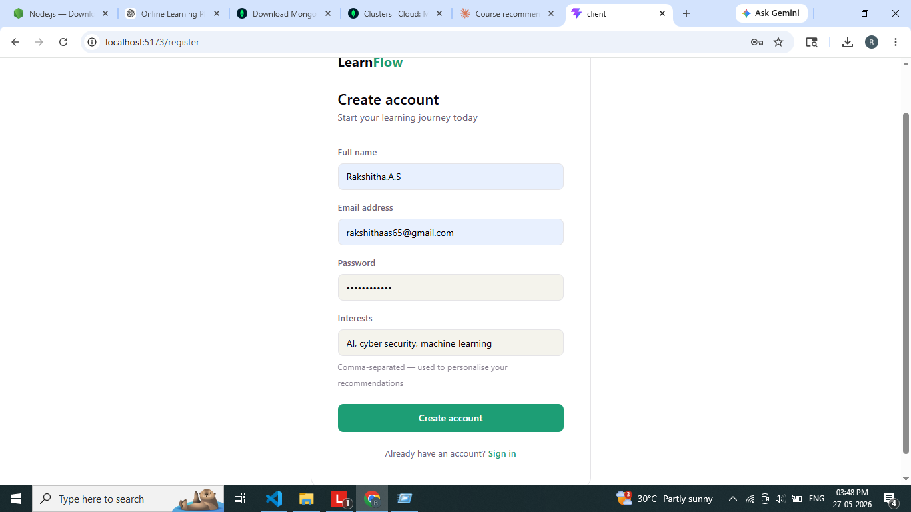
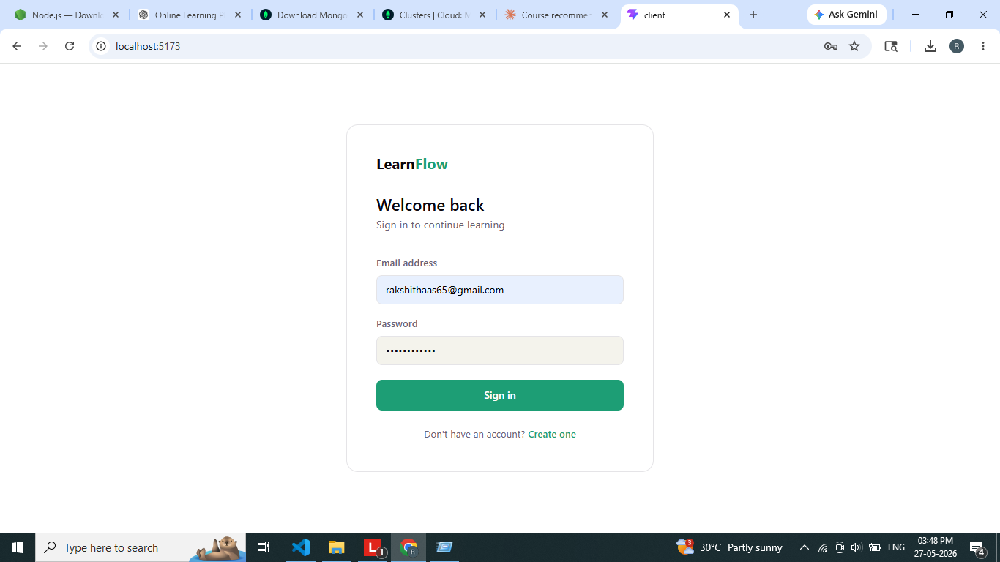
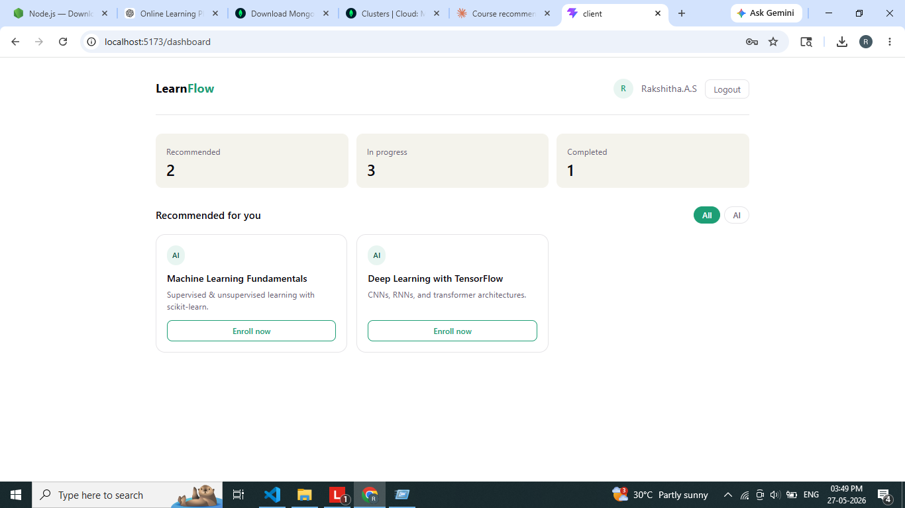

# Online Learning & Course Recommendation Platform

## 📌 Project Overview

The **Online Learning & Course Recommendation Platform** is a full-stack web application developed using the MERN Stack.
It helps learners discover courses based on their interests, skills, and learning preferences.

The platform allows users to:

* Register and login securely
* Browse available courses
* Get personalized course recommendations
* Enroll in courses
* Track learning progress
* Manage learner dashboard

This project demonstrates:

* Full Stack Web Development
* Frontend & Backend Integration
* REST API Development
* Authentication using JWT
* Recommendation System Logic
* MongoDB Database Design

---

# 🚀 Features

## 👤 Authentication

* User Registration
* User Login
* JWT Authentication
* Protected Routes

## 📚 Course Management

* Browse Courses
* Course Details Page
* Category-wise Filtering
* Course Recommendations

## 🎯 Recommendation System

Recommendations based on:

* User Interests
* Skills
* Course Categories
* Tags
* Excluding already enrolled courses

## 📈 Progress Tracking

* Enrolled Courses
* Progress Percentage
* Learner Dashboard

---

# 🛠 Tech Stack

## Frontend

* React.js
* React Router DOM
* Axios
* CSS

## Backend

* Node.js
* Express.js
* JWT Authentication

## Database

* MongoDB
* Mongoose

## Tools

* VS Code
* GitHub
* Postman

---

# 📂 Project Structure

```bash
Online-Learning-Course-Recommendation-Platform/
│
├── client/
│   ├── src/
│   ├── components/
│   ├── pages/
│   ├── services/
│   └── package.json
│
├── server/
│   ├── models/
│   ├── routes/
│   ├── controllers/
│   ├── middleware/
│   ├── config/
│   └── package.json
│
├── README.md
└── .gitignore
```

---

# ⚙️ Installation

## 1️⃣ Clone Repository

```bash
git clone https://github.com/yourusername/Online-Learning-Course-Recommendation-Platform.git
```

---

## 2️⃣ Backend Setup

```bash
cd server
npm install
```

Create `.env`

```env
MONGO_URI=your_mongodb_connection
JWT_SECRET=mysecretkey
```

Run backend:

```bash
npx nodemon index.js
```

---

## 3️⃣ Frontend Setup

```bash
cd client
npm install
npm run dev
```

---

# 🌐 Localhost URLs

## Frontend

```bash
http://localhost:5173
```

## Backend

```bash
http://localhost:5000
```

---

# 🔗 API Endpoints

## Authentication

| Method | Endpoint           | Description   |
| ------ | ------------------ | ------------- |
| POST   | /api/auth/register | Register User |
| POST   | /api/auth/login    | Login User    |

## Courses

| Method | Endpoint         | Description        |
| ------ | ---------------- | ------------------ |
| GET    | /api/courses     | Get All Courses    |
| GET    | /api/courses/:id | Get Course Details |

## Recommendations

| Method | Endpoint           | Description             |
| ------ | ------------------ | ----------------------- |
| GET    | /api/recommend/:id | Get Recommended Courses |

---

# 🧠 Recommendation Logic

The recommendation engine suggests courses based on:

* User Interests
* Selected Skills
* Course Tags
* Course Categories
* Excluding already enrolled courses

Example:

* User interested in AI → Recommend Machine Learning courses
* User interested in Web Development → Recommend MERN Stack courses

---

# 📸 Screenshots 

 ### Registration   ### Login Page  ### Dashboard 


---

🎥 Project Demo Video
📌 Watch Full Project Demo

Google Drive Video Link:

[https://drive.google.com/file/d/YOUR_FILE_ID/view?usp=sharing](https://drive.google.com/file/d/1HHPVOFciThEHx8dltnPZAud9RrqF2CLA/view?usp=drivesdk)

---

# 🎯 Learning Outcomes

This project helped in understanding:

* MERN Stack Development
* REST APIs
* Authentication
* Frontend Routing
* Backend Architecture
* Database Design
* Recommendation Systems
* GitHub Project Management

---

# 🧪 Future Improvements

* AI-based Recommendation Engine
* Payment Gateway
* Video Streaming
* Admin Dashboard
* Certificate Generation
* Real-time Notifications

---

# 👨‍💻 Author

Rakshitha A S

Cyber Security Engineering Student

---

# ⭐ GitHub Repository Tags

```text
mern-stack
reactjs
nodejs
mongodb
expressjs
fullstack-project
edtech
recommendation-system
jwt-authentication
student-project
```
